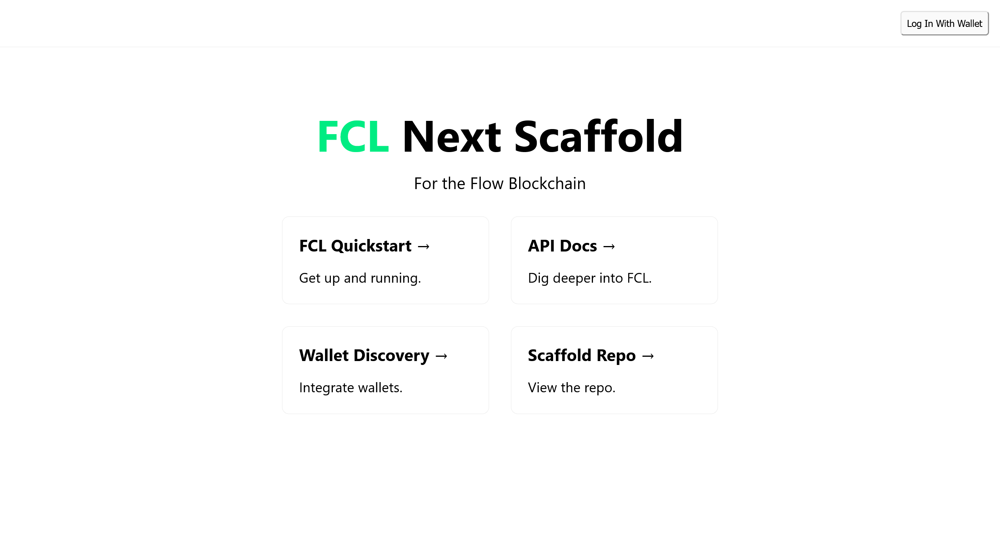

here i will write what i leart about flow blockchain, 
i am new to blockchain and trying it for first time,

so a blockchain is a chain of blocks where each block has adddress of its previous block and data in each block is hashed, so if data is changed hash changes and hence destroying the blockchain,
this is what makes the blockchain secure.
Another thing is the blockchain network is decentralized meaning each node (computer) on computer has access to the blocks this makes the blockchain transparent.

now to send any type of data to data to blockchain we need to create a smart contract.


Steps-
1. installing flow CLI from link.

2. making a basic project.
```
flow setup hello-world --scaffold
# select scaffold 5
cd hello-world
npm install
# run the app in a later step
```

this created a nextjs project,

executing 
1. flow emulator starts a local blockchain emulator.
2. flow dev acts like hot reload.

it says to move the key to a file from flow.json and in place of the key put the file in flow.json 
to do that moving key to ```key/name.key```

now after that restarting starts without any error.

3. Configuring FCL.

4. instead of flow emulator and flow dev, for flow FCL we can use this command-   npm run dev:local
running this starts a nextjs based project on port 3000 at localhost.



